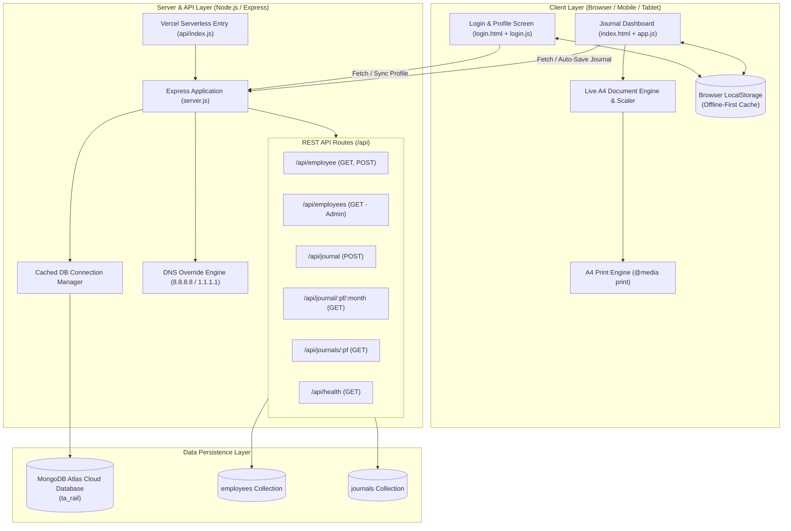

# 🚆 Travelling Allowance (TA) Journal Management System
### *Form G 37 F/R4 (S.R. G/G. 1677) – Indian Railways Digital Automation Platform*

[](https://nodejs.org/)
[](https://expressjs.com/)
[](https://www.mongodb.com/atlas)
[](https://developer.mozilla.org/)
[](https://vercel.com/)
[](https://indianrailways.gov.in/)
[](LICENSE)

---

## 📑 Table of Contents

1. [Executive Summary](#-executive-summary)
2. [Key Highlights & Business Value](#-key-highlights--business-value)
3. [System Architecture](#-system-architecture)
4. [Indian Railways TA Rules & Calculation Engine](#-indian-railways-ta-rules--calculation-engine)
5. [Feature Deep-Dive](#-feature-deep-dive)
   - [Authentication & Employee Profile Management](#1-authentication--employee-profile-management)
   - [Full-Month Calendar Auto-Generation](#2-full-month-calendar-auto-generation)
   - [Dynamic Entry Sheet (Claim & No-Claim Workflows)](#3-dynamic-entry-sheet-claim--no-claim-workflows)
   - [Overnight Journey Intelligent Splitting](#4-overnight-journey-intelligent-splitting)
   - [Pixel-Perfect A4 Live Preview & Print Engine](#5-pixel-perfect-a4-live-preview--print-engine)
   - [Offline-First Hybrid Persistence & Cloud Sync](#6-offline-first-hybrid-persistence--cloud-sync)
6. [Database Schema & Data Models](#-database-schema--data-models)
7. [REST API Documentation](#-rest-api-documentation)
8. [Project File Structure](#-project-file-structure)
9. [Installation & Local Setup](#-installation--local-setup)
10. [Configuration & Environment Variables](#-configuration--environment-variables)
11. [Deployment Guide (Vercel & Node Host)](#-deployment-guide-vercel--node-host)
12. [Future Roadmap](#-future-roadmap)
13. [License & Credits](#-license--credits)

---

## 📌 Executive Summary

The **TA Journal Management System** is an enterprise-grade digital automation web application built to eliminate the tedious, error-prone manual bookkeeping of monthly **Travelling Allowance (TA)** bills for Indian Railways staff. 

Traditionally, railway personnel (such as Ticket Supervisors, TTEs, Station Masters, Loco Pilots, Section Engineers, and Inspection Staff) manually calculate daily absence times across irregular train rosters, determine 30% / 70% / 100% allowance slabs, split overnight multi-leg journeys, tally total distances and working days, convert amounts into Indian currency words, and transcribe everything onto physical paper **Form G 37 F/R4 (S.R. G/G. 1677)** sheets.

This application brings that entire lifecycle into a modern digital platform:
- Pre-populates all calendar dates for any chosen month.
- Auto-computes duty allowances based on actual train departure and arrival timestamps.
- Intelligently splits overnight journeys crossing midnight.
- Provides multi-day batch selection for non-travel days (Rest, Leave, Sick, Station Duty).
- Delivers a 100% faithful, A4-scaled live document preview that prints directly into the official physical format without styling discrepancies.
- Offers offline-first localStorage caching backed by cloud persistence on MongoDB Atlas.

---

## ⚡ Key Highlights & Business Value

- **Official Compliance**: Conforms strictly to Indian Railways **Form G 37 F/R4** standards, retaining all required legal certifications, countersigning authority blocks, and formatting standards.
- **Accurate Allowance Computation**: Zero arithmetic mistakes with automated total absence duration tracking ($<6\text{h} \rightarrow 30\%$, $6\text{--}12\text{h} \rightarrow 70\%$, $\ge 12\text{h} \rightarrow 100\%$).
- **Smart Leg Balancing**: Automatically marks intermediate outbound journey legs with dashes (`–`) and concentrates cumulative duty allowances on the final destination arrival row.
- **Overnight Train Engine**: When a train journey crosses midnight ($T_{\text{dept}}$ on Date 1, $T_{\text{arr}}$ on Date 2), the system automatically creates two synchronized journal rows with proper time accounting.
- **A4 Pixel-Perfect Printing**: Pure CSS `@media print` engine with zero margin overrides, table header repeating (`thead { display: table-header-group }`), row protection against mid-page page breaks, and scale neutralization for mobile previews.
- **Network & DNS Resiliency**: Custom DNS server fallbacks to Google and Cloudflare Public DNS (`8.8.8.8`, `1.1.1.1`) to overcome Indian ISP SRV lookup failures on MongoDB Atlas clusters.
- **Serverless Ready**: Equipped with an Express-to-Serverless adaptor bridge (`/api/index.js`) and cached Mongoose connection pooling for instantaneous Vercel cold starts.

---

## 🏗️ System Architecture



---

## ⚖️ Indian Railways TA Rules & Calculation Engine

The system encodes the standard Indian Railways rules governing Travelling Allowance claims:

### 1. Daily Allowance Duration Slabs
Travelling Allowance is calculated based on total absence from the headquarters station within a 24-hour calendar day:

| Total Absence from HQ | Claim Percentage | Applied Rate | Remarks |
|:---|:---:|:---:|:---|
| **Under 6 Hours** ($< 360\text{ mins}$) | **30%** | $\text{TA Rate} \times 0.30$ | Short inspection or quick turnaround duty |
| **6 Hours to Under 12 Hours** ($360\text{--}719\text{ mins}$) | **70%** | $\text{TA Rate} \times 0.70$ | Medium duration tour / single shift tour |
| **12 Hours or Greater** ($\ge 720\text{ mins}$) | **100%** | $\text{TA Rate} \times 1.00$ | Full day duty / overnight absence |

### 2. Intermediate Leg Balancing Rule
When an employee undertakes multiple journey segments on the same day (e.g., HQ $\rightarrow$ Intermediate Junction $\rightarrow$ Remote Station $\rightarrow$ HQ):
1. All intermediate / outbound rows display a dash (`–`) for Day/Night % and Amount.
2. The final journey row of that date accumulates the total absence across all segments and claims the full slab amount.

### 3. Overnight Journeys Crossing Midnight
For journeys spanning two different dates (e.g., departing at 22:30 on 14-Aug and arriving at 06:15 on 15-Aug):
- **Departure Date (14-Aug)**: Counts absence from departure time until 24:00 (midnight). Absence = $90\text{ mins} \rightarrow 30\%$.
- **Arrival Date (15-Aug)**: Counts absence from 00:00 (midnight) until arrival time. Absence = $375\text{ mins} \rightarrow 70\%$.
- Both rows reflect the same train number and duty objective.

---

## 🚀 Feature Deep-Dive

### 1. Authentication & Employee Profile Management
- Located at [login.html](file:///d:/Projects/%C2%A9%EF%B8%8FDeployed/TA%20Journal/login.html) and [login.js](file:///d:/Projects/%C2%A9%EF%B8%8FDeployed/TA%20Journal/login.js).
- Captures comprehensive Indian Railway administrative attributes:
  - **Personal**: Full Name, Provident Fund (PF) No. *(Primary Unique Key)*, Date of Appointment.
  - **Organisational**: Zone (16 Indian Railway Zones supported), Division, Branch (Commercial, Operating, Electrical, Engineering, S&T, Accounts, etc.), Station / HQ Code.
  - **Pay Matrix**: Designation (Standard or Custom), 7th CPC Pay Matrix Level (1 through 14), Basic Pay, Grade Pay, Pay Scale / Band, and Daily TA Rate.
- **Bi-directional Prefill**: When a user inputs their PF number or opens the page, local storage is checked first, followed by MongoDB cloud synchronization to load the latest saved profile.

### 2. Full-Month Calendar Auto-Generation
- Once a target Month and Year are picked from the top toolbar or sidebar, the application automatically constructs a complete journal structure for every calendar day (28, 29, 30, or 31 days).
- If a journal already exists in MongoDB Atlas for that `{ pf, month }`, it is immediately loaded and rendered. Otherwise, blank working rows with standard defaults are created.

### 3. Dynamic Entry Sheet (Claim & No-Claim Workflows)
- Triggered via the modern floating **＋** action button (FAB).
- Opens a responsive, animated slide-up modal bottom sheet with two dedicated modes:
  - **Claim Tab**: For operational journeys. Accepts Train/Vehicle No., departure date & time, arrival date & time, origin station, destination station, distance in kilometers, and operational objective (A.C. Manning, Sleeper, Checking, Inspection, Escorting, etc.).
  - **No-Claim Tab**: For administrative or leave statuses. Allows multi-date range selection (`From Date` to `To Date`) with instant batch assignment of objectives (Rest, Leave, Sick, Office Duty, Station Duty, Special). Automatically resets distance and amounts to zero without modifying unrelated days.

### 4. Overnight Journey Intelligent Splitting
- Detects when arrival date is greater than departure date.
- Employs an intelligent splitting routine:
  ```javascript
  // Departure Row
  { date: deptDate, train: trainNo, depart: deptTime, arrival: '', from: fromStn, to: '' }
  // Arrival Row
  { date: arrDate,  train: trainNo, depart: '', arrival: arrTime, from: '', to: toStn }
  ```
- Evaluates allowances separately for each date using `rebalanceDayAllowances()`.
- Automatically transitions across month boundaries if the arrival crosses into the subsequent month.

### 5. Pixel-Perfect A4 Live Preview & Print Engine
- Real-time on-screen layout replicates the authentic printed form down to font sizes, table line weights, and certificate endorsements.
- **Dynamic Mobile Scaler**: Uses JavaScript viewport measurement to automatically scale the A4 canvas on smartphones and tablets, preventing horizontal overflow while preserving layout proportions.
- **Print Sanitisation**: Hooks into `window.addEventListener('beforeprint')` to temporarily remove all scaling transforms, guaranteeing that the browser print dialog receives a pure 210mm $\times$ 297mm A4 portrait document.

### 6. Offline-First Hybrid Persistence & Cloud Sync
- Every row modification, month generation, or profile edit is written instantaneously to browser `localStorage`.
- In the background, asynchronous `fetch()` dispatches sync the data to MongoDB Atlas.
- If the network drops or the cloud database is temporarily unreachable, the app operates uninterrupted and informs the user via subtle floating badges.

---

## 🗄️ Database Schema & Data Models

### Employee Model (`models/Employee.js`)
Stores employee biographical, pay structure, and organizational details.

| Field | Type | Required | Unique | Default | Description |
|:---|:---:|:---:|:---:|:---:|:---|
| `pf` | `String` | **Yes** | **Yes** | — | Unique Provident Fund / Employee ID number |
| `name` | `String` | **Yes** | No | — | Full name of the railway employee |
| `designation` | `String` | No | No | `""` | Official post (e.g. CCTS, TTE, SM, LP) |
| `customDesig` | `String` | No | No | `""` | Custom designation if "Custom" option was selected |
| `branch` | `String` | No | No | `""` | Department branch (e.g. Commercial, Operating) |
| `zone` | `String` | No | No | `""` | Railway Zone (e.g. N.E.R., N.R., W.R.) |
| `division` | `String` | No | No | `""` | Divisional headquarters code (e.g. BSB, LKO) |
| `hq` | `String` | No | No | `""` | HQ station code (stored in UPPERCASE) |
| `doa` | `String` | No | No | `""` | Date of Appointment in `YYYY-MM-DD` |
| `doaFormatted`| `String` | No | No | `""` | Human-readable appointment date (e.g. `03 August 2000`) |
| `basicPay` | `String` | No | No | `""` | Monthly Basic Pay in INR |
| `level` | `String` | No | No | `""` | 7th CPC Pay Matrix Level (1 to 14) |
| `gp` | `String` | No | No | `""` | Grade Pay in INR (6th CPC legacy mapping) |
| `scale` | `String` | No | No | `""` | Pay scale band (e.g. `9300-34800`) |
| `taRate` | `String` | No | No | `""` | Entitled daily TA rate in INR per day |
| `lastLogin` | `Date` | No | No | `Date.now` | Timestamp of last profile update / session |

---

### Journal Model (`models/Journal.js`)
Stores monthly journal claim records with an embedded array of daily journey rows.

```javascript
// Compound Index
{ pf: 1, month: 1 } // Unique constraint: one document per employee per month
```

| Field | Type | Description |
|:---|:---:|:---|
| `pf` | `String` *(Indexed)* | Links journal to employee by PF number |
| `month` | `String` | Target period in `YYYY-MM` format (e.g., `2026-08`) |
| `monthLabel` | `String` | Formatted month string (e.g., `August 2026`) |
| `totalAmount` | `Number` | Sum of all daily allowance claim amounts |
| `workingDays` | `Number` | Count of active duty days (excluding Rest & Leave) |
| `rows` | `[journeyRowSchema]` | Array of individual journey items |
| `createdAt` | `Date` | Timestamp of journal initial creation |
| `updatedAt` | `Date` | Timestamp of most recent update |

#### Embedded `journeyRowSchema`

| Field | Type | Description | Example |
|:---|:---:|:---|:---|
| `date` | `String` | Journey date (`YYYY-MM-DD`) | `2026-08-15` |
| `train` | `String` | Train number or vehicle registration | `12500` |
| `depart` | `String` | Departure time in 24h format (`HH:MM`) | `22:30` |
| `arrival` | `String` | Arrival time in 24h format (`HH:MM`) | `06:15` |
| `from` | `String` | Origin station code | `BSB` |
| `to` | `String` | Destination station code | `PRYJ` |
| `dist` | `String` | Distance traveled in kilometers | `415` |
| `dayNight` | `String` | Percentage rate applied | `30%`, `70%`, `100%`, or `""` |
| `amount` | `String` | Computed allowance in INR | `700.00` |
| `objective` | `String` | Duty objective / reason for absence | `A.C. Manning`, `Rest`, `Leave` |

---

## 📡 REST API Documentation

Base URI: `/api`

### 1. Employee Endpoints

#### Upsert Employee Profile
```http
POST /api/employee
Content-Type: application/json
```
**Request Body**:
```json
{
  "pf": "50405538877",
  "name": "Rajesh Kumar Bharti",
  "branch": "Commercial",
  "zone": "N.E.R.",
  "division": "BSB",
  "hq": "BSB",
  "designation": "CCTS",
  "doa": "2000-08-03",
  "basicPay": "50500",
  "level": "6",
  "gp": "4200",
  "scale": "9300-34800",
  "taRate": "1000"
}
```
**Response (200 OK)**:
```json
{
  "success": true,
  "message": "Employee profile saved.",
  "data": { ... }
}
```

#### Fetch Employee by PF
```http
GET /api/employee/:pf
```
**Response (200 OK)**:
```json
{
  "success": true,
  "message": "Employee found.",
  "data": { ... }
}
```

#### List All Employees (Admin Summary)
```http
GET /api/employees
```
**Response (200 OK)**:
```json
{
  "success": true,
  "message": "4 employees found.",
  "data": [
    { "pf": "...", "name": "...", "designation": "...", "hq": "...", "lastLogin": "..." }
  ]
}
```

---

### 2. Journal Endpoints

#### Save / Upsert Month Journal
```http
POST /api/journal
Content-Type: application/json
```
**Request Body**:
```json
{
  "pf": "50405538877",
  "month": "2026-08",
  "monthLabel": "August 2026",
  "totalAmount": 24500,
  "workingDays": 26,
  "rows": [ ... ]
}
```
**Response (200 OK)**:
```json
{
  "success": true,
  "message": "Journal saved.",
  "data": { ... }
}
```

#### Fetch Journal for Employee & Month
```http
GET /api/journal/:pf/:month
```
**Response (200 OK)**:
```json
{
  "success": true,
  "message": "Journal found.",
  "data": {
    "pf": "50405538877",
    "month": "2026-08",
    "totalAmount": 24500,
    "workingDays": 26,
    "rows": [ ... ]
  }
}
```

#### List All Saved Months for Employee
```http
GET /api/journals/:pf
```
**Response (200 OK)**:
```json
{
  "success": true,
  "message": "5 journal(s) found.",
  "data": [
    { "month": "2026-08", "monthLabel": "August 2026", "totalAmount": 24500, "workingDays": 26 }
  ]
}
```

#### Health Check
```http
GET /api/health
```
**Response (200 OK)**:
```json
{
  "success": true,
  "server": "TA Rail Journal API",
  "mongo": "connected"
}
```

---

## 📂 Project File Structure

```
d:/Projects/©️Deployed/TA Journal/
├── .env                         # Environment variables (PORT, MONGO_URI)
├── .gitignore                   # Git exclusion rules for node_modules, keys, OS artifacts
├── package.json                 # Project configuration, dependencies, and start scripts
├── package-lock.json            # Exact dependency lockfile
│
├── server.js                    # Express application entrypoint, middleware & REST endpoints
├── api/
│   └── index.js                 # Serverless adapter for Vercel deployment
│
├── models/                      # Mongoose schema definitions
│   ├── Employee.js              # Employee profile data model
│   └── Journal.js               # Monthly journal claim data model
│
├── index.html                   # Main dashboard, toolbar, live preview & entry sheet
├── app.js                       # Frontend state, TA calculation engine, print & sync handlers
├── style.css                    # Design system, dark UI theme, and A4 print stylesheet
│
├── login.html                   # Authentication, registration & profile editor view
├── login.js                     # Login validation, localStorage sync & prefill logic
├── login.css                    # Split-pane glassmorphism theme & particle background styles
│
├── logo/                        # Official assets
│   └── TA Journal.png           # High-resolution application insignia
│
└── details/                     # Reference materials & sample documents (ignored in git)
    ├── TA_February_426.pdf      # Scanned Form G 37 F/R4 reference bill
    ├── TA_July_626.pdf          # Scanned Form G 37 F/R4 reference bill
    └── TA_July_626.jpg          # High-resolution reference photograph
```

---

## 💻 Installation & Local Setup

### Prerequisites
- [Node.js](https://nodejs.org/) version **18.0.0 or later**
- [npm](https://www.npmjs.com/) (bundled with Node.js)
- A running [MongoDB](https://www.mongodb.com/) instance or a free MongoDB Atlas connection URI

### 1. Clone Repository
```bash
git clone https://github.com/harshanandbadal/TA-Journal.git
cd "TA-Journal"
```

### 2. Install Dependencies
```bash
npm install
```

### 3. Configure Environment Variables
Create a `.env` file in the project root:
```env
PORT=3000
MONGO_URI=mongodb+srv://<username>:<password>@<cluster-address>/ta_rail?retryWrites=true&w=majority
```

### 4. Launch Application
For standard production execution:
```bash
npm start
```

For hot-reloading development server:
```bash
npm run dev
```

### 5. Access in Browser
- **Login / Profile Setup**: [http://localhost:3000/login.html](http://localhost:3000/login.html)
- **Main Journal Dashboard**: [http://localhost:3000/](http://localhost:3000/)
- **API Health Verification**: [http://localhost:3000/api/health](http://localhost:3000/api/health)

---

## ⚙️ Configuration & Environment Variables

| Variable | Required | Default | Description |
|:---|:---:|:---:|:---|
| `PORT` | Optional | `3000` | Port on which Express server listens |
| `MONGO_URI` | **Yes** | — | MongoDB Atlas SRV connection string with authentication |

> [!NOTE]
> In environments where public DNS servers are restricted or ISPs hijack SRV records, `server.js` automatically binds Node's DNS resolver to `8.8.8.8`, `8.8.4.4`, and `1.1.1.1`.

---

## ☁️ Deployment Guide (Vercel & Node Host)

### Deploying to Vercel
1. The repository includes `/api/index.js` which exports `server.js` as a serverless function handler.
2. In the Vercel Dashboard:
   - Import the GitHub repository: `harshanandbadal/TA-Journal`.
   - Set **Framework Preset** to `Other`.
   - Under **Environment Variables**, configure:
     - `MONGO_URI`: Your MongoDB Atlas connection string.
3. Deploy. All static assets (`index.html`, `style.css`, `app.js`, etc.) are served from the root, while requests to `/api/*` are handled by the serverless function.

---

## 🔮 Future Roadmap

- [ ] **Multi-User Role-Based Access Control (RBAC)**: Support for Branch Admin / Bill Clerks to approve or audit journals submitted by staff.
- [ ] **Direct PDF Export**: Client-side single-click PDF generation via PDFKit or html2pdf to bypass browser print dialogs on mobile devices.
- [ ] **Multi-Month Comparison & Trend Analytics**: Visual charts showing annual TA earnings, average distance traveled, and top duty stations.
- [ ] **Export to CSV / Excel**: Exporting data directly formatted for Indian Railways IPAS (Integrated Payroll and Accounting System).
- [ ] **Train Schedule Auto-Completion**: Integration with National Train Enquiry System (NTES) or Indian Railway timetable APIs to auto-populate arrival/departure times from train numbers.

---

## 📄 License & Credits

- **Author**: Harsh Anand Badal ([@harshanandbadal](https://github.com/harshanandbadal))
- **Copyright**: © 2026 Harsh Anand Badal. All rights reserved.
- **License**: Released under the [MIT License](LICENSE). You are free to use, modify, and distribute this software with attribution.
- **Form Standard**: Indian Railways Form G 37 F/R4 (S.R. G/G. 1677), governed by standard rules of Travelling Allowance.
- **Repository**: [https://github.com/harshanandbadal/TA-Journal](https://github.com/harshanandbadal/TA-Journal)
